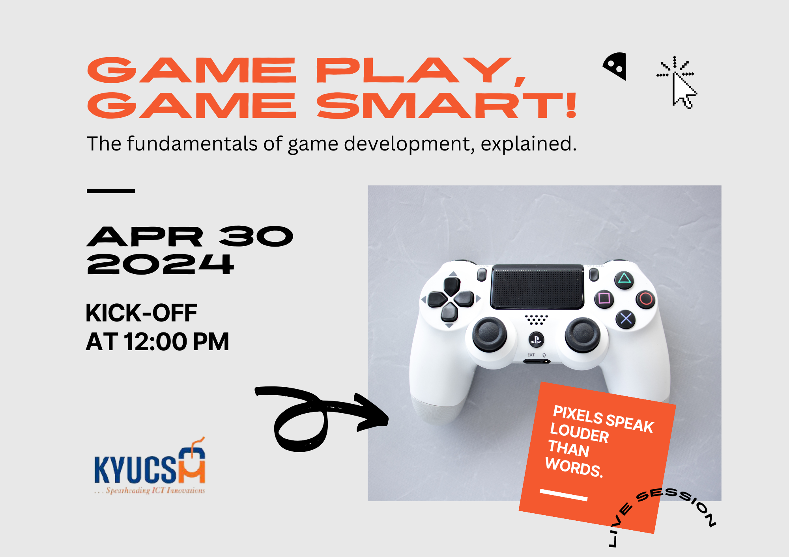

# Introduction to Game Development

Welcome to the world of game development! 

This readme provides an overview of the core concepts in this field, essential for programmers venturing into game development.

## Demos

This section contains the console-based maze game developed during the session and a browser-based game developed for inspiration.

- Maze - [Code](https://github.com/kyucs/sessions/tree/main/game-dev-intro/maze/)
    
    

- DuckGo - [Code](https://github.com/kyucs/sessions/tree/main/game-dev-intro/duckgo/) - [Demo](./duckgo/)

    

## Core Concepts

This section contains handpicked concepts that you should learn in order to have solid foundation in game development. 

1. **Game Loop**: The game loop is the central structure that continuously updates and renders the game state, ensuring smooth gameplay and interaction.

2. **Graphics Rendering**: Graphics rendering involves rendering pipelines, shaders, and graphics APIs like OpenGL or DirectX, enabling the creation of visually appealing games.

3. **Physics Simulation**: Physics engines simulate realistic movement and collisions within the game world, enhancing the game's immersion and realism.

4. **Input Handling**: Input handling manages player input from various sources such as keyboard, mouse, gamepads, and touch screens, enabling interaction with the game.

5. **Collision Detection**: Collision detection algorithms identify collisions between game objects, crucial for implementing gameplay mechanics like object interaction and obstacle avoidance.

6. **Game AI**: Game AI techniques create believable and challenging non-player characters (NPCs) and opponents, enhancing the game's entertainment value and replayability.

7. **Data Structures and Algorithms**: Understanding data structures and algorithms is vital for optimizing game performance and implementing complex game mechanics efficiently.

8. **Networking**: Network programming facilitates the implementation of multiplayer features such as multiplayer game modes, matchmaking, and server-client architecture, enabling multiplayer gaming experiences.

9. **Game Design Patterns**: Game design patterns, such as the entity-component system and state machines, provide reusable solutions to common design challenges in game development, streamlining the development process.

10. **Optimization Techniques**: Optimization techniques optimize game performance, including rendering optimizations, memory management, and algorithmic optimizations, ensuring smooth gameplay across different platforms.

11. **Sound and Music**: Integrating sound effects and music enhances the game's atmosphere and immersion, enriching the player's gaming experience.

12. **User Interface (UI)**: Designing and implementing user interfaces for menus, HUDs (Heads-Up Displays), and in-game UI elements improves usability and enhances the player's interaction with the game.

13. **Game Development Engines**: Explore popular game development engines such as Unity, Unreal Engine, and Godot Engine, which provide powerful tools and workflows for creating games.

14. **Game Design Principles**: Explore fundamental game design principles such as player motivation, game mechanics, level design, and player feedback, essential for creating engaging and enjoyable games.

15. **Artificial Intelligence in Games**: Delve deeper into game AI techniques such as pathfinding, behavior trees, and decision-making algorithms, crucial for creating intelligent and dynamic NPCs.

## Further Self-Study

- [HTML5 Canvas API](https://developer.mozilla.org/en-US/docs/Web/API/Canvas_API): A complete guide to creating animation, game graphics, data visualization, photo manipulation, and real-time video processing via [JavaScript](https://developer.mozilla.org/en-US/docs/Web/JavaScript) and the [HTML Canvas](https://developer.mozilla.org/en-US/docs/Web/HTML/Element/canvas) element.
- [Game Programming Patterns](http://gameprogrammingpatterns.com/): A comprehensive guide to common design patterns used in game development.
- [Unity Learn](https://learn.unity.com/): Explore tutorials and resources for learning Unity, a popular game development engine used to create 2D and 3D games.

---

🚀 Happy game developing!
